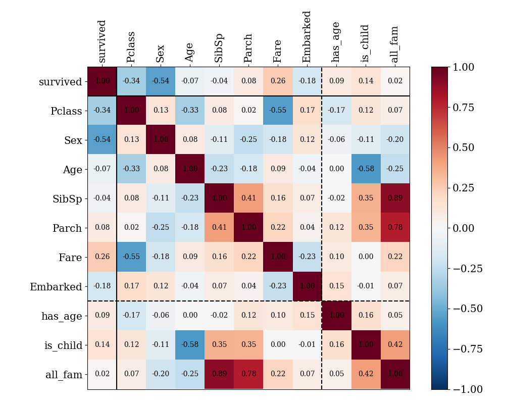

# Titanic (Kaggle exercise, https://www.kaggle.com/c/titanic)

The scripts in this directory interpret the csv-files provided in the Titanic Kaggle exercise, build a random forest classifier, and predict whether each passenger in the test data survives or not.
This code correctly predicted the outcomes of 77% of passengers in the test set. 

## Correlation matrix
The correlation of features in the training sample is shown. Since empty "Age" values were replaced with the sample average, an additional "has_age" feature is created.

